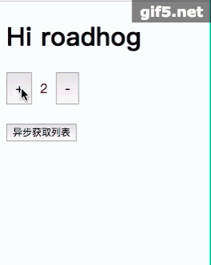

### snapshot



### install

npm install rc-ctrl


### usage

index.js

```jsx

import React from 'react';
import { ctrl } from 'rc-ctrl';
import { getInitState, actions } from './logic';

const styles = {
    btn: {
        fontSize: 16, 
        padding: 10,
    },
    count: {
        fontSize: 16, 
        padding: 10,
        color: 'red'
    }
}

@ctrl({getInitState, actions})
export default class MainController extends React.Component {
    render() {
        const { count, list, isLoading } = this.props.state;
        const { increase, getList } = this.props.actions;
        return <div>
            <button style={styles.btn} onClick={() => increase(1)}>+</button>
            <span style={styles.count}>{count}</span>
            <button style={styles.btn} onClick={() => increase(-1)}>-</button>

            <br/>
            <br/>

            <button onClick={getList}>
                {
                    isLoading ? '正在加载请等待' : '异步获取列表'
                }
            </button>

            <div>
                {
                    isLoading ? null : list.map(item => {
                        return <div key={item}>{item}</div>
                    })
                }
            </div>
        </div>
    }
}

```

logic.js

```jsx

import * as API from './api';
import { compose, map, curry } from 'ramda';

export function getInitState() {
    return {
        count: 1,
        isLoading: false,
        list: []
    }
}

export function actions({dispatch}) {
    return {
        increase: dispatch(increase),
        getList: compose(dispatch(getList), map(result), API.getList),
        getListWithData: function(data) {
            return compose(dispatch(getListWithData), promiseWithData(data), map(result), API.getList)()
        }
    }
}

var promiseWithData = curry((data, promise) => {
    return {
        data,
        promise
    }
})

function result(response) {
    return response.result || [];
}

function getListWithData(state, { payload }, status) {
    if (status === 'PENDING') {
        // get data
        return { ...state, isLoading: true, data: payload }
    } else if (status === 'REJECTED') {
        return { ...state, isLoading: false }
    } else {
        return { ...state, isLoading: false, list: payload }
    }
}

function getList(state, { payload }, status) {
    if (status === 'PENDING') {
        return { ...state, isLoading: true }
    } else if (status === 'REJECTED') {
        return { ...state, isLoading: false }
    } else {
        return { ...state, isLoading: false, list: payload }
    }
}

function increase(state, { payload }) {
    return {
        ...state,
        count: state.count + payload
    }
}

```


api.js

```jsx

import { FjsPromise } from 'rc-ctrl';

export function getList() {
    return new FjsPromise((resolve, reject) => {
        setTimeout(() => {
            resolve({
                result: [
                    '苹果',
                    '橘子',
                    '柿子'
                ]
            });
        }, 2000);
    })
}

```
